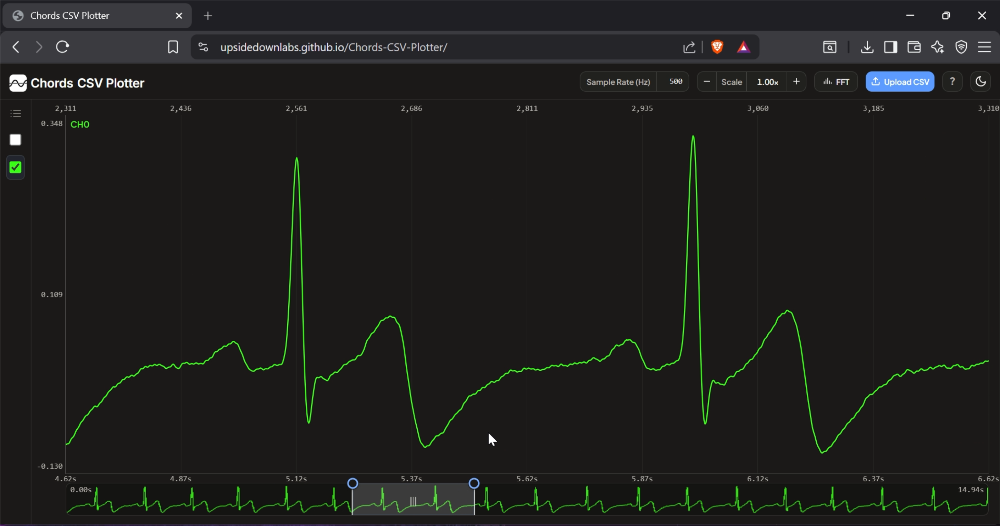
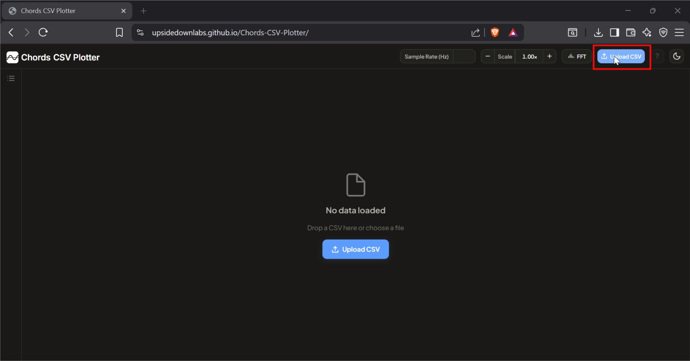
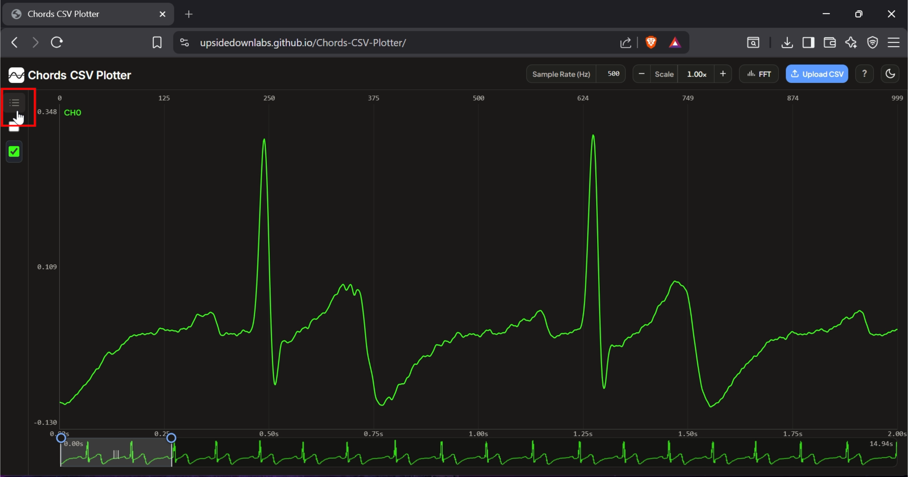
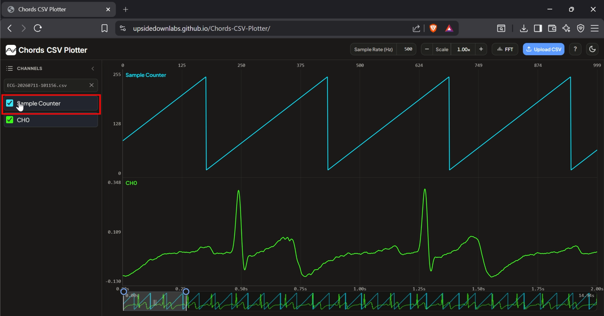
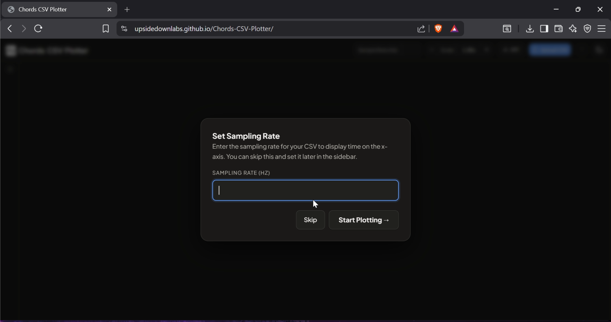
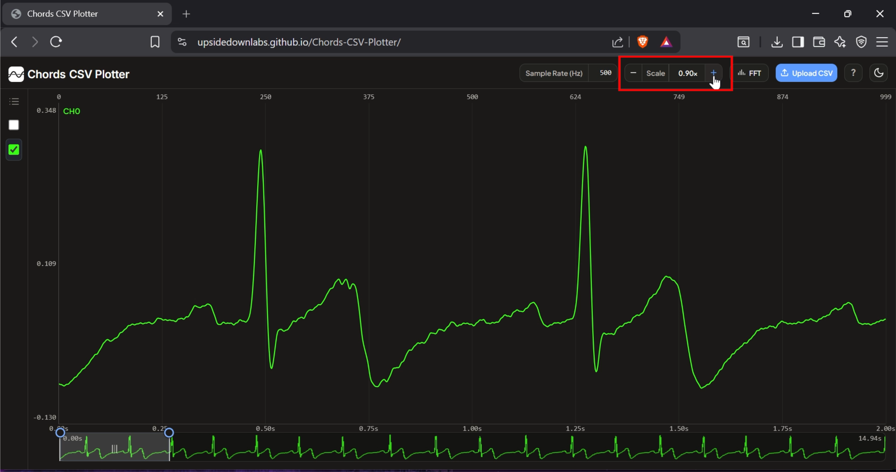
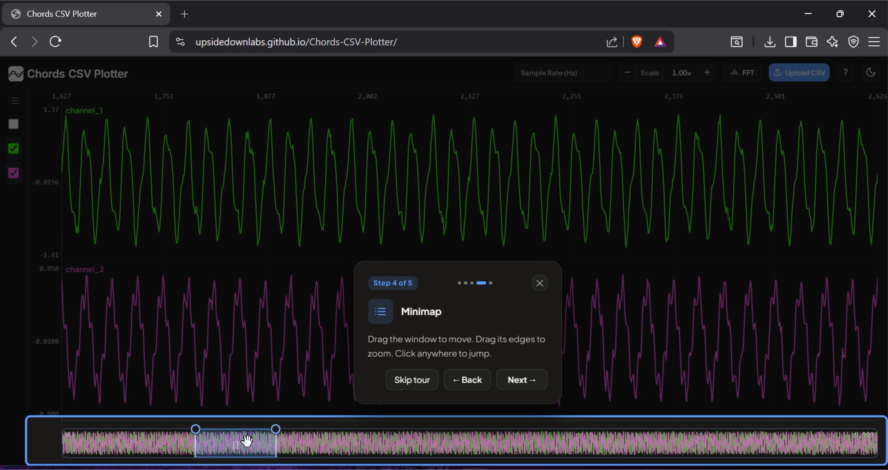
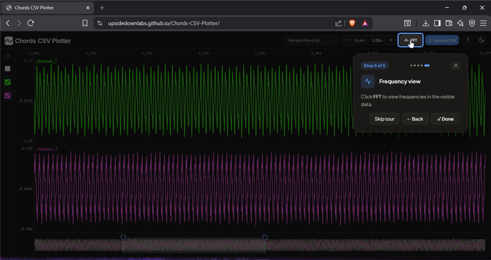
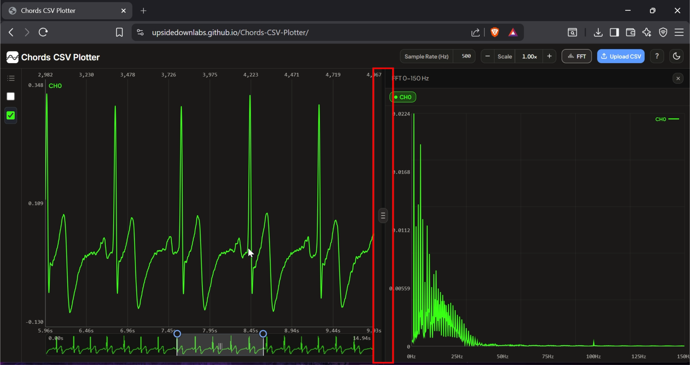
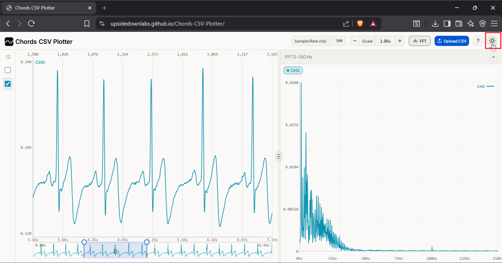

.. _chords-csv-plotter:

Chords CSV Plotter
###################

.. youtube:: b9qSuuJwDvE

Overview
********

Chords CSV Plotter is a free, browser-based tool for visualizing and analysing **time-series CSV data**. It is designed to help you view recordings exported from Chords directly in your browser, without installing any extra software. Everything runs client-side, so your data never leaves your computer, making it a quick way to explore biopotential signals such as EEG, EMG, ECG, EOG, or any other numeric CSV recording, including IMU and vibration data.

    Chords CSV Plotter Overview

Requirements
************

- A modern Chromium, Firefox, or Safari based browser (no installation or build step required).
- A time-series CSV file, such as EEG, EMG, ECG, EOG, or IMU data.

.. tip::

   If you don't already have a CSV recording, learn how to record and export data using :ref:`Chords-Web <chords>` in this tutorial: `Recording data with Chords <https://www.youtube.com/watch?v=cbAZcs6EuHI&t=79s>`_.

Features
********

.. list-table::
   :widths: 25 75
   :header-rows: 1

   * - **Feature**
     - **Description**
   * - **CSV Upload**
     - Upload or drag and drop a time-series CSV recording directly into the browser.
   * - **Multi-Channel Plotting**
     - Plot multiple numeric channels together and choose which ones to display from the channel list.
   * - **Minimap Navigation**
     - Move and resize the minimap window to quickly navigate long recordings.
   * - **Sampling Rate**
     - Enter a sample rate to display **time** instead of sample index on the horizontal axis.
   * - **Vertical Scale**
     - Adjust the vertical scale to make signals easier to read and compare.
   * - **FFT Viewer**
     - View the frequency content of the visible signal, useful for EEG, EMG, ECG, and other time-series data.
   * - **Resizable Layout**
     - Drag panel borders to resize the plot and FFT Viewer for more workspace.
   * - **Light / Dark Theme**
     - Switch between light and dark mode for comfortable viewing.

Running the Application
*************************

Open `Chords CSV Plotter <https://upsidedownlabs.github.io/Chords-CSV-Plotter/>`_ in your web browser. The first time you upload a CSV file, the tool shows a short interactive tour explaining the main features.

Uploading Your CSV File
=========================

Click **Upload CSV** and choose your time-series CSV file, or drag and drop it anywhere on the page. Once the file is uploaded, the tool loads your data and prepares it for visualization.

    Upload CSV

Viewing the Channel List
==========================

Click the channel list icon in the top-left corner to open the channel panel and see all the channels available in your recording.

    Channel List

Selecting Channels
====================

Choose the channels you want to view from the channel list. As soon as you select a channel, its signal appears on the graph, and you can display one or multiple channels at the same time.

    Select Channels

Setting the Sampling Rate
============================

Enter the sampling rate of your recording in the **Sample Rate (Hz)** field. This step is optional but recommended: it changes the horizontal axis from sample numbers to **time**, making it easier to understand when events occurred during the recording.

    Set Sampling Rate

Adjusting the Vertical Scale
===============================

Use the **Scale** control to zoom the signal amplitude in or out, making the waveform easier to read and compare across channels.

    Adjust Vertical Scale

Navigating with the Minimap
==============================

Drag the minimap window to move through the recording, or drag its edges to zoom into a specific time range. You can also click anywhere on the minimap to jump directly to that point.

    Minimap Slider

Using the FFT Viewer
======================

Click **FFT** to open the Frequency Viewer and see the frequencies present in the visible part of your signal. This is useful for analysing signals such as EEG, EMG, ECG, IMU and vibration data, and other time-series recordings.

    FFT Button

Resizing the Workspace
========================

Drag the panel border between the plot and the FFT Viewer to resize the workspace, giving more room to whichever view you need.

    Adjust FFT Panel Size

Switching the Theme
======================

Click the theme toggle button to switch between **Light Mode** and **Dark Mode**, and choose whichever is most comfortable for you.

    Toggle Theme

Technologies Used
*******************

Chords CSV Plotter is built with plain **HTML5**, **CSS3**, and **vanilla JavaScript**, using the HTML5 **Canvas API** to render the plot, minimap, and FFT views. It has no external framework or plotting library dependencies, so it loads instantly and works entirely in the browser.
